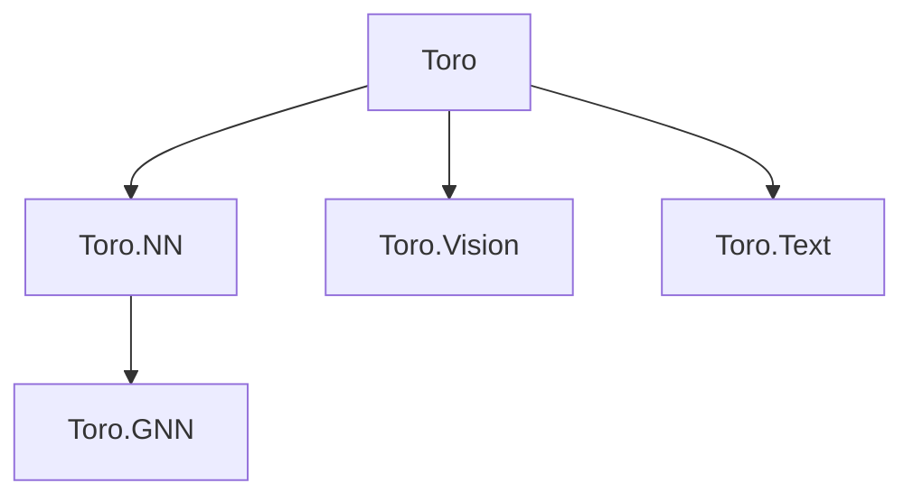

# Code Map

## Architecture Overview

Toro is an F# machine learning framework with PyTorch-style semantics, built on TorchSharp (.NET 10). The monorepo contains 6 library packages under `src/`, 6 test projects, 14 examples, and a React Router v7 documentation site. Models are plain F# records composed via interfaces and computation expressions.

## Package Dependency Graph



## Package Index

### Toro — `src/Toro/`

Core tensor API wrapping TorchSharp. Namespace: `Toro`.

| File | Role |
|------|------|
| `Tensor.fs` | `Tensor` type alias, `TIdx` indexing DU, comparison operators, automatic and explicit scoped CEs, `Toro.noGrad`/`inferenceMode` |
| `SafeTensors.fs` | SafeTensors file read/write/metadata and single-file or sharded readers |

### Toro.NN — `src/Toro.NN/`

Neural network layers, training utilities. Namespace: `Toro.NN`.

| File | Role |
|------|------|
| `Module.fs` | `IModule<'In,'Out>` interface (base composable layer) |
| `Init.fs` | Weight initialization functions |
| `Model.fs` | Reflection or descriptor-based `ModelState` discovery, validation, and persistence |
| `Layer/Linear.fs` | Dense layer |
| `Layer/Conv.fs` | Conv1d, Conv2d |
| `Layer/Embedding.fs` | Embedding layer |
| `Layer/Dropout.fs` | Dropout |
| `Layer/LayerNorm.fs`, `BatchNorm.fs`, `GroupNorm.fs`, `InstanceNorm.fs` | Normalization layers |
| `Layer/Activation.fs` | Activation functions as modules |
| `Layer/Pooling.fs` | Pooling layers |
| `Block/Sequential.fs` | `sequential { }` CE for layer stacking |
| `Block/Func.fs` | `pipeline { }` CE for function composition |
| `Block/RNN.fs` | LSTM, GRU |
| `Block/Attention.fs` | MultiHeadAttention, TransformerBlock |
| `Block/KvCache.fs` | KV cache for autoregressive inference |
| `Loss.fs` | Loss functions |
| `Metrics.fs` | Accuracy and other metrics |
| `Optim.fs` | SGD, Adam, AdamW optimizers (record-based) |
| `Scheduler.fs` | Learning rate schedulers |
| `Clip.fs` | Gradient clipping |
| `Checkpoint.fs` | Model + optimizer checkpointing |

### Toro.GNN — `src/Toro.GNN/`

Graph neural networks. Namespace: `Toro.GNN`.

| File | Role |
|------|------|
| `Data/GraphData.fs` | Graph node features + edge index |
| `Data/Batch.fs` | Batched graphs |
| `Utils/GraphUtils.fs` | Graph utility functions |
| `Conv/MessagePassing.fs` | Base message-passing layer |
| `Conv/GCNConv.fs`, `GATConv.fs`, `SAGEConv.fs`, `GINConv.fs` | Convolution variants |
| `Pool/GlobalPool.fs` | Global graph pooling |
| `Norm/GraphNorm.fs` | Graph normalization |

### Toro.Hub — `src/Toro.Hub/`

Single-file Hugging Face Hub downloader. Namespace: `Toro.Hub`.

| File | Role |
|------|------|
| `Hub.fs` | Download models/weights from HF Hub |

### Toro.Vision — `src/Toro.Vision/`

Image I/O and transforms. Namespace: `Toro.Vision`.

| File | Role |
|------|------|
| `Image.fs` | Image load/save, tensor conversion |
| `SkiaTransform.fs` | SkiaSharp-based image transforms |
| `Transform.fs` | Composable transform pipeline (Resize, Normalize, etc.) |

### Toro.Text — `src/Toro.Text/`

Text tokenization. Namespace: `Toro.Text`.

| File | Role |
|------|------|
| `Tokenizer.fs` | Wrapper over Microsoft.ML.Tokenizers |
| `Encode.fs` | Encode text to tensor |

## Design Patterns

- **Record-based models**: Models are F# records holding tensors and sub-modules. `Model.state` uses attribute-driven reflection; `Model.stateWith` accepts an explicit descriptor. Both produce the same validated `ModelState`.
- **`IModule<'In,'Out>`**: Single `forward` method interface. Most layers implement the shorthand `IModule` (= `IModule<Tensor, Tensor>`).
- **Tensor scopes**: `scoped { }` auto-keeps return-value tensors; `scopedExplicit { }` retains only tensors passed to `Tensor.keep`.
- **`sequential { }` CE**: Builds a `Sequential` record from a list of `IModule` layers; folds `forward` left-to-right.
- **`pipeline { }` CE**: Composes arbitrary `'a -> 'b` functions and `IModule.forward` calls via `>>`.
- **Named optimizer state**: SGD and AdamW implement `IOptimizer`; AdamW state is keyed by canonical parameter name.
- **SafeTensors for persistence**: `ModelState` and checkpoint loading validate all metadata before reading and copying one tensor at a time.

## Project Layout

```
src/           — 6 library packages
tests/         — 6 test projects (xUnit + FsUnit, TorchSharp-cpu)
examples/      — 14 runnable console apps
docs/          — React Router v7 site (pnpm, MDX)
scripts/       — API doc generation (FSDocs → MDX)
.github/       — CI (ci.yml), docs deploy (docs.yml), NuGet release (release.yml)
```

- Solution: `Toro.slnx` (XML format, not `.sln`)
- Shared test config: `tests/Directory.Build.props`
- Nix dev shell: `flake.nix` (sets native library paths for TorchSharp)
- Formatting: Fantomas via `lefthook.yml` pre-commit hook

## Conventions

- All public APIs carry `///` XML doc comments.
- Each example has its own `README.md`.
- CI publishes 5 packages to NuGet on `v*.*.*` tag (Hub excluded).
- TorchSharp version pinned at 0.107.0 across all projects.

## Maintenance

- Update this file when packages are added/removed or design patterns change.
- Do not document volatile details (function signatures, line numbers).
