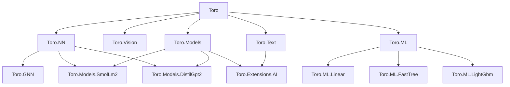

# Code Map

## Architecture Overview

Toro is an F# machine learning framework with PyTorch-style semantics, built on TorchSharp (.NET 10). The monorepo contains 14 library packages under `src/`, 14 test projects, 15 examples, and a React Router v7 documentation site. Models are plain F# records composed via interfaces and computation expressions.

## Package Dependency Graph



## Package Index

### Toro — `src/Toro/`

Core tensor API wrapping TorchSharp. Namespace: `Toro`.

| File | Role |
|------|------|
| `Tensor.fs` | `Tensor` type alias, `TIdx` indexing DU, comparison operators, automatic and explicit scoped CEs, `Toro.noGrad`/`inferenceMode`/`mapScoped` |
| `SafeTensors.fs` | SafeTensors file read/write/metadata and single-file or sharded readers |

### Toro.NN — `src/Toro.NN/`

Neural network layers, training utilities. Namespace: `Toro.NN`.

| File | Role |
|------|------|
| `Module.fs` | `IModule<'In,'Out>` interface (base composable layer) |
| `Init.fs` | Weight initialization functions |
| `Model.fs` | Reflection or descriptor-based `ModelState` discovery, validation, persistence, and dtype conversion |
| `Layer/Linear.fs` | Dense layer |
| `Layer/Conv.fs` | Conv1d, Conv2d |
| `Layer/Embedding.fs` | Embedding layer |
| `Layer/Dropout.fs` | Dropout |
| `Layer/LayerNorm.fs`, `BatchNorm.fs`, `GroupNorm.fs`, `InstanceNorm.fs` | Normalization layers |
| `Layer/Activation.fs` | Activation functions as modules |
| `Layer/Pooling.fs` | Spatial pooling |
| `Layer/SequencePool.fs` | Masked mean over token sequences |
| `Block/Sequential.fs` | `sequential { }` CE for layer stacking |
| `Block/Func.fs` | `pipeline { }` CE for function composition |
| `Block/RNN.fs` | LSTM, GRU |
| `Block/Attention.fs` | MultiHeadAttention, PreNormTransformerBlock, PostNormTransformerBlock, `Attention.additiveMask` |
| `Block/KvCache.fs` | KV cache for autoregressive inference |
| `Loss.fs` | Loss functions |
| `Metrics.fs` | Accuracy and other metrics |
| `Optim.fs` | SGD, Adam, AdamW optimizers (record-based) |
| `Scheduler.fs` | Learning rate schedulers, including linear warmup and warmup-then-decay |
| `Clip.fs` | Gradient clipping |
| `Checkpoint.fs` | Model + optimizer checkpointing |

### Toro.GNN — `src/Toro.GNN/`

Graph neural networks. Namespace: `Toro.GNN`.

| File | Role |
|------|------|
| `Data/GraphData.fs` | Graph node features + edge index |
| `Data/Batch.fs` | Batched graphs |
| `Utils/GraphUtils.fs` | Graph utility functions |
| `Conv/MessagePassing.fs` | Base message-passing layer |
| `Conv/GCNConv.fs`, `GATConv.fs`, `SAGEConv.fs`, `GINConv.fs` | Convolution variants |
| `Pool/GlobalPool.fs` | Global graph pooling |
| `Norm/GraphNorm.fs` | Graph normalization |

### Toro.Hub — `src/Toro.Hub/`

Single-file Hugging Face Hub downloader. Namespace: `Toro.Hub`.

| File | Role |
|------|------|
| `Hub.fs` | Download models/weights from HF Hub |

### Toro.Models — `src/Toro.Models/`

Shared causal language-model contracts, token-level generation, and model-family interop. Namespace: `Toro.Models`.

| File | Role |
|------|------|
| `CausalLm.fs` | Typed causal LM contract and prefill/decode operations |
| `Sampling.fs`, `Generation.fs` | Sampling policies and request-local generation sessions |
| `Interop/` | IntelliSense-hidden JSON, local asset, tensor ownership, causal input, and fixed KV cache helpers for model-family packages |

### Toro.Models.SmolLm2 — `src/Toro.Models.SmolLm2/`

SmolLM2 model-family implementation. Public namespace: `Toro.Models`.

| File | Role |
|------|------|
| `Types.fs` | SmolLM2 configuration and layer records |
| `Cache.fs` | SmolLM2 fixed-capacity grouped-query KV cache |
| `Checkpoint.fs` | Hugging Face SmolLM2 config loading and validation |
| `Model.fs` | Architecture, named state descriptor, forward pass, causal LM adapter, and local loader |

### Toro.Models.DistilGpt2 — `src/Toro.Models.DistilGpt2/`

DistilGPT-2 model-family implementation. Public namespace: `Toro.Models`.

| File | Role |
|------|------|
| `Types.fs` | DistilGPT-2 configuration and layer records |
| `Cache.fs` | DistilGPT-2 fixed-capacity KV cache |
| `Checkpoint.fs` | Hugging Face GPT-2 config loading and validation |
| `Model.fs` | Architecture, named state descriptor, forward pass, causal LM adapter, and local loader |

### Toro.Extensions.AI — `src/Toro.Extensions.AI/`

Microsoft.Extensions.AI adapter. Namespace: `Toro.Extensions.AI`.

| File | Role |
|------|------|
| `ChatClient.fs` | Text-only `IChatClient` adapter, request validation, incremental streaming decode, and cancellation |

### Toro.Vision — `src/Toro.Vision/`

Image I/O and transforms. Namespace: `Toro.Vision`.

| File | Role |
|------|------|
| `Image.fs` | Image load/save, tensor conversion |
| `SkiaTransform.fs` | SkiaSharp-based image transforms |
| `Transform.fs` | Composable transform pipeline (Resize, Normalize, etc.) |

### Toro.Text — `src/Toro.Text/`

Text tokenization. Namespace: `Toro.Text`.

| File | Role |
|------|------|
| `MicrosoftML.fs` | Microsoft.ML.Tokenizers factories (including BERT and SentencePiece BOS/EOS/dummy-prefix options), custom encode/decode wrappers, public tokenizer façade, and incremental decoding |
| `Collation.fs` | Encode text to padded tensors via CollationLength (Fixed or BatchMax) |

### Toro.ML — `src/Toro.ML/`

Shared tensor datasets and ML.NET conversion for classical machine learning. Namespace: `Toro.ML`.

| File | Role |
|------|------|
| `DatasetValidation.fs` | Shared internal feature and label tensor invariants |
| `RankingDataset.fs` | Validated tensor-backed ranking dataset with contiguous query groups |
| `RegressionDataset.fs` | Validated tensor-backed regression dataset |
| `Interop.fs` | IntelliSense-hidden shared scoring plus task-specific Tensor to `IDataView` conversion for algorithm packages |

### Toro.ML.Linear — `src/Toro.ML.Linear/`

Related linear trainers included with standard ML.NET, grouped in one physical package while retaining algorithm-specific namespaces and types.

| File | Role |
|------|------|
| `Sdca/Regression.fs` | SDCA-specific regression config, model, operations, metrics, and ML.NET zip persistence |

### Toro.ML.FastTree — `src/Toro.ML.FastTree/`

FastTree regression and learning-to-rank. Namespace: `Toro.ML.FastTree`.

| File | Role |
|------|------|
| `Regression.fs` | FastTree-specific regression config, model, operations, metrics, and ML.NET zip persistence |
| `Ranking.fs` | FastTree-specific ranking config, model, operations, metrics, and ML.NET zip persistence |

### Toro.ML.LightGbm — `src/Toro.ML.LightGbm/`

LightGBM regression and learning-to-rank. Namespace: `Toro.ML.LightGbm`.

| File | Role |
|------|------|
| `Regression.fs` | LightGBM-specific regression config, model, operations, metrics, and ML.NET zip persistence |
| `Ranking.fs` | LightGBM-specific ranking config, model, operations, metrics, and ML.NET zip persistence |

## Growth Direction

- **`Toro` remains the tensor substrate**: tensor extensions, lifetime management, and tensor serialization belong in the root package. It does not acquire trainer, model-family, modality, or service dependencies.
- **Training paradigms branch above the substrate**: `Toro.NN` owns differentiable neural-network composition and optimization, while `Toro.ML` owns borrowed task datasets and ML.NET interop for classical machine learning.
- **Algorithms grow at dependency-family granularity**: packages such as `Toro.ML.FastTree` and `Toro.ML.LightGbm` isolate dedicated dependencies, while `Toro.ML.Linear` groups standard trainers under algorithm namespaces such as `Sdca`. Tasks grow inside those namespaces, and config and model types remain task- and algorithm-specific.
- **Modalities stay orthogonal**: `Toro.Text`, `Toro.Vision`, and `Toro.GNN` provide domain data and operations without becoming mandatory dependencies of the root package.
- **Reusable architectures grow by model family**: `Toro.Models` owns causal LM contracts, generation, and hidden extension interop. Concrete packages such as `Toro.Models.SmolLm2` and `Toro.Models.DistilGpt2` combine it with `Toro.NN` without adding model implementations to the shared package.
- **External adapters stay at the leaves**: `Toro.Hub` owns remote assets and `Toro.Extensions.AI` owns ecosystem integration. These packages may compose lower layers but lower layers do not depend on them.

## Design Patterns

- **Record-based models**: Models are F# records holding tensors and sub-modules. `Model.state` uses attribute-driven reflection; `Model.stateWith` accepts an explicit descriptor. Both produce the same validated `ModelState`.
- **`IModule<'In,'Out>`**: Single `forward` method interface. Most layers implement the shorthand `IModule` (= `IModule<Tensor, Tensor>`).
- **Tensor scopes**: `scoped { }` auto-keeps return-value tensors; `scopedExplicit { }` retains only tensors passed to `Tensor.keep`. Nested `scoped` in long loops (or `Toro.mapScoped`) disposes per-item activations.
- **`sequential { }` CE**: Builds a `Sequential` record from a list of `IModule` layers; folds `forward` left-to-right.
- **`pipeline { }` CE**: Composes arbitrary `'a -> 'b` functions and `IModule.forward` calls via `>>`.
- **Named optimizer state**: SGD and AdamW implement `IOptimizer`; AdamW state is keyed by canonical parameter name.
- **SafeTensors for persistence**: `ModelState` and checkpoint loading validate all metadata before reading and copying one tensor at a time.
- **Pretrained models**: `Toro.Models` owns typed causal LM operations and request-local generation without depending on `Toro.NN`; each `Toro.Models.*` family owns its architecture, named state, cache, and local loader without depending on Hub, tokenizers, or HTTP.
- **Extensions.AI adapter**: `Toro.Extensions.AI` maps Microsoft chat messages and options to request-local Toro generation sessions and incremental token decoding without owning model state.

## Project Layout

```
src/           — 14 library packages
tests/         — 14 test projects (xUnit + FsUnit, TorchSharp-cpu)
examples/      — 15 runnable console apps
docs/          — React Router v7 site (pnpm, MDX)
scripts/       — API doc generation (FSDocs → MDX)
.github/       — CI (ci.yml), docs deploy (docs.yml), NuGet release (release.yml)
```

- Solution: `Toro.slnx` (XML format, not `.sln`)
- Shared test config: `tests/Directory.Build.props`
- Nix dev shell: `flake.nix` (sets native library paths for TorchSharp)
- Formatting: Fantomas via `lefthook.yml` pre-commit hook

## Conventions

- All public APIs carry `///` XML doc comments.
- Each example has its own `README.md`.
- The release workflow uses an explicit package allow-list; new packages remain excluded until publication is approved.
- TorchSharp version pinned at 0.107.0 across all projects.

## Maintenance

- Update this file when packages are added/removed or design patterns change.
- Do not document volatile details (function signatures, line numbers).
