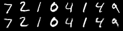

# MnistAutoencoder

Train an autoencoder on MNIST and save reconstructed images.

## Run

```bash
dotnet run --project examples/MnistAutoencoder
```

MNIST is downloaded automatically on first run. After training, `reconstruction.png` is saved in the example directory.



## Concepts

- Encoder/decoder architecture with `sequential { }` CE
- `Loss.mse` for reconstruction loss
- `Tensor.cat` to combine original and reconstructed images
- Image output with `torchvision.utils.save_image`
