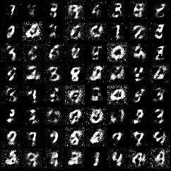

# MnistGan

Train a GAN to generate MNIST digit images.

## Run

```bash
dotnet run --project examples/MnistGan
```

MNIST is downloaded automatically on first run. After training, `generated.png` is saved in the example directory.



## Concepts

- Separate Generator and Discriminator networks
- Two optimizers with independent `Model.trainableVars`
- `Loss.binaryCrossEntropyWithLogit` for adversarial training
- `Tensor.detach` to stop gradients through generated samples
